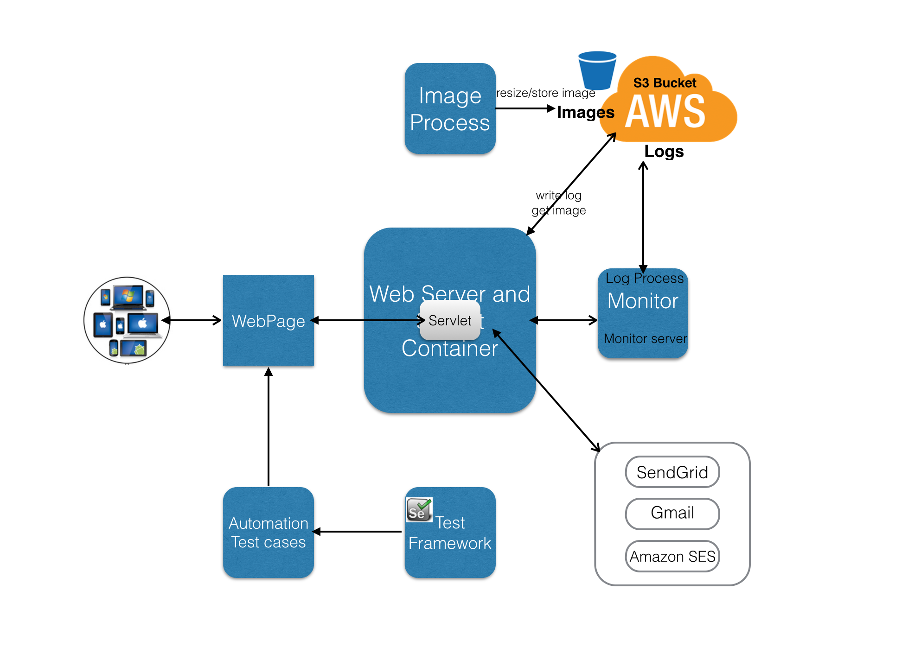

Design for simple Email Service
 
    1. Web Page:  need to support all major languages, OS and PC and mobile device display.
    2. Web Sever/servlet talk to different Email Providers
    3. The request log will write to AWS S3 buckets
    4. Image process will resize all image for this service and restore it at AWS S3 bucket
    5. Build a monitor service to check the server status and the request log at AWS S3 bucket. Show the charts with real-time data
    6. Build a Automation Test Framework with Selenium webdriver for the web service
    7. implement the Test cases for smoke, sanity, regression Test.
    
    However I only implemented a simplified solution with limited time.
    The design graph is shown below.
     
     
     Simplified Solution:  
     This project more focus on back end. because I do not have any front end experience before this project.
     This project front end use Html, Css, Javascript.
     This project back end use Jetty Servlet by Java.	
    
    BackEnd:
    1) EmailServlet class: an SendEamill object will send email at doPost method and will send respond back to web page
    2) SendEamil class: try to send email by a SendGridService object, if failed, will try again by GmailService object
    3) class SendGridService and class GmailService both extends from class EmailService
    4) class EmailService is a abstract class to keep information of email information and lookup host name and check if the host is active or not
    
    More Detail for Back End:
    1) use multiple from email accounts to send email with by Round-robin algorithm
    2) use AtomicInteger counter to count of requests, and overflow of int was taken care
    3) before send out email, the host service status will be checked. if the host is not active, try another email service
    4) the password of from email address is encoded and decoded for security reason
    5) Unit Test: most important method has unit test case
    
    Front End
    1) Welcome page (http://localhost:8080/) has navigation bar to project.html, email.html, and readme.html
    2) email.html (http://localhost:8080/email.html) is the most important web page to input and send email information 
           emailprocess.js will send data to and retrieve from server
    3) project.html include the problem of the project
    4) readme.html provide readme 
    5) css files describing the look and formating web pages 
    
    More Detail for Front End
    1) email input is required with pattern checking, name, subject, message can not be null
    2) any input is wrong, the error message will be shown
    3) an alert message will be show as result of email sending. and it could be close by click
    4) a back home page button to go back to home page
    
    BTW, I choose java to implement back end, only because it is my primary coding language. and I could implement this project fast. I understand some people might prefer different language such as Scala, PHP, goLang...
    
    Experience with technical stack in this project:
	HTML, CSS,  AJAX/JavaScript:  No experience before this project
	Java: 4 years experience.
	Server/Servlet:  a couple of small projects

  How to Use APIs:

    1) SendEmail
    public SendEmail(String toAddress, String fullName, String subject, String emailText);
    public boolean send();
    send method will send email by SendGridService object if failed, try GmailService object. If email send, return true, otherwise false.
    
    2) SendGridService
    public SendGridService(String toAddress, String fullName, String subject, String emailText) 
    public boolean sendEmail();
    sendEmail method send email by SendGrid, it return true if email send, otherwise false.
    
    3) GemailService
    public GmailService(String toAddress, String fullName, String subject, String emailText)
    public boolean sendEmail();
    sendEmail method send email by Gmail, it return true if email send, otherwise false.
    
    String toAddress: the email address you like send email to. Can not be null or empty
    String fullName: Your full Name. 
    String subject: The subject of your email 
    String emailText: Your email message.
 			
 Running environment:
 
	command line to run: mvn jetty:run
	java 1.7
	maven 3
	Max OS X Yosemite  Version 10.10
	Browser Google Chrome: Version 41.0.2272.118 (64-bit)
	Safari: Version 8.0.4 (10600.4.10.7)
	
  Limitation:
  
	Only one to email account is allowed at this moment because of limited time
	Only Google Chrome: Version 41.0.2272.118 (64-bit) and Safari: Version 8.0.4 (10600.4.10.7) on Max OS X Yosemite  Version 10.10 are tested 
	the password encode and decode need a real encode/decode algorithm
		
Need to be improved:

	FrontEnd
	1. all the image should located at AWS S3 bucket instead of local
	2. the image should be resized for different device.
	3. need to support more languages
	4. need to Support Windows, Linux, Unix, MacOX, Android, IOS Operation System
	5. need to Support display nice on major types of mobile device
	6. Testing: need to implement unit testing for javascript code

	BackEnd
	1. need to handle multiple To email addresses send at same time
	2. need to Read number of from email address and email address from properties file
	3. Use protoBuf to send data to server instead of Json
	4. Email Service:
	1) Write the counter of request to S3 bucket hourly, this will help for monitor
	5. Build a monitor to Continually checking the status of the email service
	1) if the email server working or not
	2) check the log at S3 bucket of email server for hourly request information and show it as real time

	Testing:
	Need more testing on different OX and Browser
	Need more unit test, smoke test, sanity and regression test
	Use Selenium to implement automation testing framwork and test cases
	
  Other Information:
	    
    We have total four testing account for sending out email. all password are same. 
		customerservicetesting0@gmail.com
		customerservicetesting1@gmail.com
		customerservicetesting0@sendgrid.com
		customerservicetesting1@sendgrid.com
		
	Author:
		This project implemented by Selina Wu
		Some classes for css at HTML file from Bootstrap 
		All background image download from web.	   